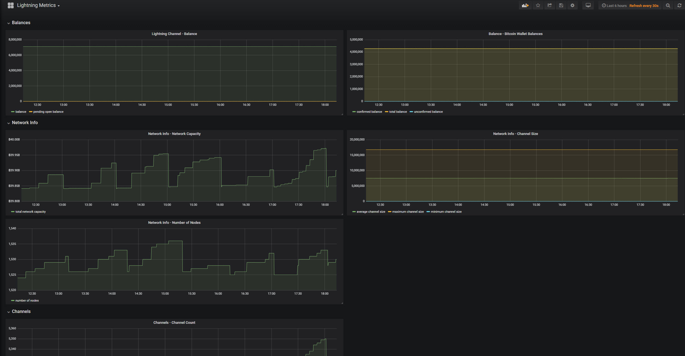

# RaspiBolt Guide

## Overview

When setting up a Raspberry using the [RaspiBolt Guide](https://github.com/badokun/guides/tree/master/raspibolt) and the 
[Bonus guide: Performance Monitoring](https://github.com/badokun/guides/blob/master/raspibolt/raspibolt_71_monitoring.md) section adding Lightning Node metrics is very simple.

> Your Lightning wallet must be unlocked for metrics to be availble

## Configuration

On a RaspiBolt setup you will find the configuration file at `/home/bitcoin/.lnd/lnd.conf`

```
[Application Options]
tlsextraip=0.0.0.0
restlisten=0.0.0.0:8080
no-macaroons=true
```

> The `tlsextraip` is required if you plan on running the application on different machine to where the [Lightning Network Daemon](https://github.com/lightningnetwork/lnd) ️is running. To simplify configuration
the `no-macaroons` option should be set to `true`.

## Installation

The easiest method to run metrics collection on a Raspberry Pi is by running the Docker image.

### Test connectivity to the LND REST API
```
 docker run --rm --net host --name lnd-metrics-arm32-test \
        badokun/lnd-metrics:arm32 \
        --influxDbUri http://127.0.0.1:8086 \
        --network testnet \
        --lndRestApiUri https://127.0.0.1:8080 \
        --test-lndApi
```

`2019-01-14T15:36:14.4858644+00:00 DEBUG LndApi test operation completed successfully`

### Test connectivity to the InfluxDb

```
 docker run --rm --net host --name lnd-metrics-arm32-test \
        badokun/lnd-metrics:arm32 \
        --influxDbUri http://127.0.0.1:8086 \
        --network testnet \
        --lndRestApiUri https://127.0.0.1:8080 \
        --test-influxDb
```

`2019-01-14T15:37:01.2207211+00:00 DEBUG InfluxDb write operation completed successfully`

### Start collecting metrics

When you've confirmed connectivity to both the LND REST API and InfluxDb you can ommit the `--rm` flag. Pro tip: to keep it always running on a restart add `--restart always`

```
 docker run --restart always -d --net host --name lnd-metrics-arm32 \
        badokun/lnd-metrics:arm32 \
        --influxDbUri http://127.0.0.1:8086 \
        --network testnet \
        --lndRestApiUri https://127.0.0.1:8080
```

### Upgrading

When a new lnd-metrics docker image is released perform the following to upgrade
```
docker pull badokun/lnd-metrics:arm32
docker stop lnd-metrics-arm32
docker rm lnd-metrics-arm32

docker run --restart always -d --net host --name lnd-metrics-arm32 \
        badokun/lnd-metrics:arm32 \
        --influxDbUri http://127.0.0.1:8086 \
        --network testnet \
        --lndRestApiUri https://127.0.0.1:8080
```

## Grafana Dashboard

Add a new dashboard in Grafana (refer to the [Bonus guide: Performance Monitoring](https://github.com/badokun/guides/blob/master/raspibolt/raspibolt_71_monitoring.md) on how to do this)
by using the id `9663`



## Troubleshooting

#### Inspect the logs

If no metrics are being sent to InfluxDb you can run the following command to get the logs `docker logs lnd-metrics-arm32`

If the logs are littered with messages like below, you need to `unlock` your wallet. In some cases you may need to restart your Lnd daemon.

`2019-01-14T12:29:47.7104245+00:00 ERROR The HTTP status code of the response was not expected (404).`

#### Restarting Lnd daemon

`sudo systemctl restart lnd`

View the service's log file
`sudo journalctl -f -u lnd`