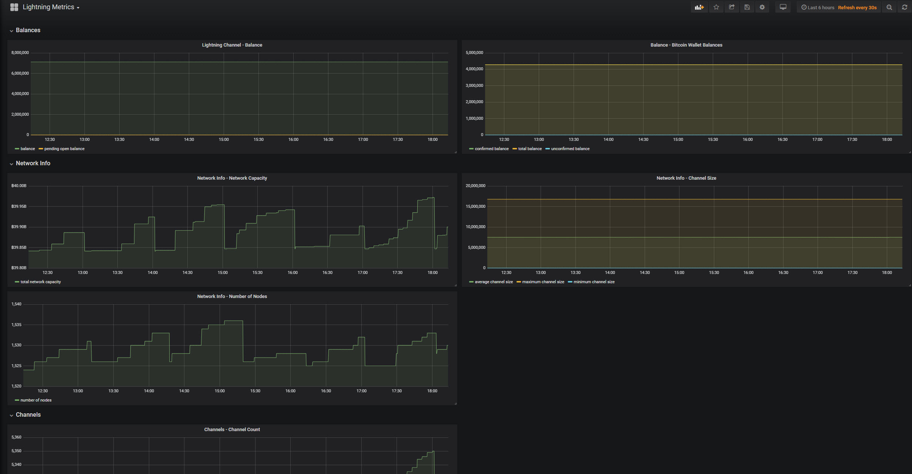

[ [Intro](intro.md) ] -- [ [Performance Monitoring](performance_monitoring.md) ] -- [ [**Lightning Metrics**](lightning_metrics.md) ] -- [ [Bonus](bonus.md) ] -- [ [Troubleshooting](troubleshooting.md) ]

------

# Lightning Metrics

Once you've completed the [Performance Monitoring](performance_monitoring.md) section you are now ready to add Lightning metrics.

> Your Lightning wallet must be unlocked for metrics to be availble

## Configuration

Edit the Lightning daemon's configuration. On a RaspiBolt setup you will find the configuration file at `/home/bitcoin/.lnd/lnd.conf`

```yml
[Application Options]
tlsextraip=0.0.0.0
restlisten=0.0.0.0:8080
```

> The `tlsextraip` is required if you plan on running the application on different machine to where the [Lightning Network Daemon](https://github.com/lightningnetwork/lnd) ️is running.
> When adding the `tlsextraip` setting you may need to regenerate the tls.cert, tls.key and macaroon files. To test it's all working access the `/v1/getinfo` endpoint, e.g.  <https://192.168.1.40:8080/v1/getinfo.> You should see `{"error":"expected 1 macaroon, got 0","code":2}` as the response.

## Installation

### Security

There are two variables that is required when accessing the LND REST API, `certThumbprintHex` and `macaroonHex`

#### certThumbprintHex - Extracting the certificate thumbprint

On a Linux machine execute at the location where you certificate files are, e.g. `/home/bitcoin/.lnd`

```bash
 openssl x509 -noout -fingerprint -sha256 -inform pem -in tls.cert
```

#### macaroonHex - Extracing the admin.macaroon hex string

On a Linux machine execute at the location where your macaroon files are, e.g. for testnet `/home/bitcoin/.lnd/data/chain/bitcoin/testnet`

```bash
xxd -p admin.macaroon | tr -d '\n' && echo " "
```

In the examples below both `certThumbprintHex` and `macaroonHex` have been shortened for brevity.

### Test connectivity to the LND REST API

```bash
 docker run --rm --net host --name lnd-metrics-arm32-test \
        badokun/lnd-metrics:arm32 \
        --influxDbUri http://127.0.0.1:8086 \
        --network testnet \
        --lndRestApiUri https://127.0.0.1:8080 \
        --certThumbprintHex BC:C5... \
        --macaroonHex 402bb... \
        --test-lndApi
```

`2019-01-14T15:36:14.4858644+00:00 DEBUG LndApi test operation completed successfully`

### Test connectivity to the InfluxDb

```bash
 docker run --rm --net host --name lnd-metrics-arm32-test \
        badokun/lnd-metrics:arm32 \
        --influxDbUri http://127.0.0.1:8086 \
        --network testnet \
        --lndRestApiUri https://127.0.0.1:8080 \
        --certThumbprintHex BC:C5... \
        --macaroonHex 402bb... \
        --test-influxDb
```

`2019-01-14T15:37:01.2207211+00:00 DEBUG InfluxDb write operation completed successfully`

### Start collecting metrics

When you've confirmed connectivity to both the LND REST API and InfluxDb you can omit the `--rm` flag. Pro tip: to keep it always running on a restart add `--restart always`

```bash
 docker run --restart always -d --net host --name lnd-metrics-arm32 \
        badokun/lnd-metrics:arm32 \
        --influxDbUri http://127.0.0.1:8086 \
        --network testnet \
        --lndRestApiUri https://127.0.0.1:8080 \
        --certThumbprintHex BC:C5... \
        --macaroonHex 402bb... \
```

### Upgrading

When a new lnd-metrics docker image is released perform the following to upgrade

```bash
docker pull badokun/lnd-metrics:arm32
docker stop lnd-metrics-arm32
docker rm lnd-metrics-arm32

docker run --restart always -d --net host --name lnd-metrics-arm32 \
        badokun/lnd-metrics:arm32 \
        --influxDbUri http://127.0.0.1:8086 \
        --network testnet \
        --lndRestApiUri https://127.0.0.1:8080 \
        --certThumbprintHex BC:C5... \
        --macaroonHex 402bb... \
```

## Grafana Dashboard

Add a new dashboard in Grafana (refer to the [Performance Monitoring](performance_monitoring.md) on how to do this)
by using the id `9663`



## Troubleshooting

### Inspect the logs

If no metrics are being sent to InfluxDb you can run the following command to get the logs `docker logs lnd-metrics-arm32`

If the logs are littered with messages like below, you need to `unlock` your wallet. In some cases you may need to restart your Lnd daemon.

`2019-01-14T12:29:47.7104245+00:00 ERROR The HTTP status code of the response was not expected (404).`

### Restarting Lnd daemon

`sudo systemctl restart lnd`

View the service's log file `sudo journalctl -f -u lnd`

------

Donations

If you feel like this has beenn useful and wish to donate, feel free to send a satoshi or two to this address, obviously use Lightning for near free instant transfers:

* 👉 BTC: `bc1qx2hn38vc8f0fkn3hu8pmpuglg35ctqvx2rzzjs`
* 👉 Lightning: <https://tippin.me/@rubberroad>