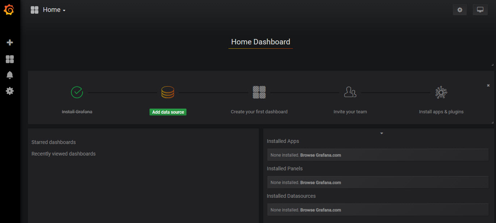
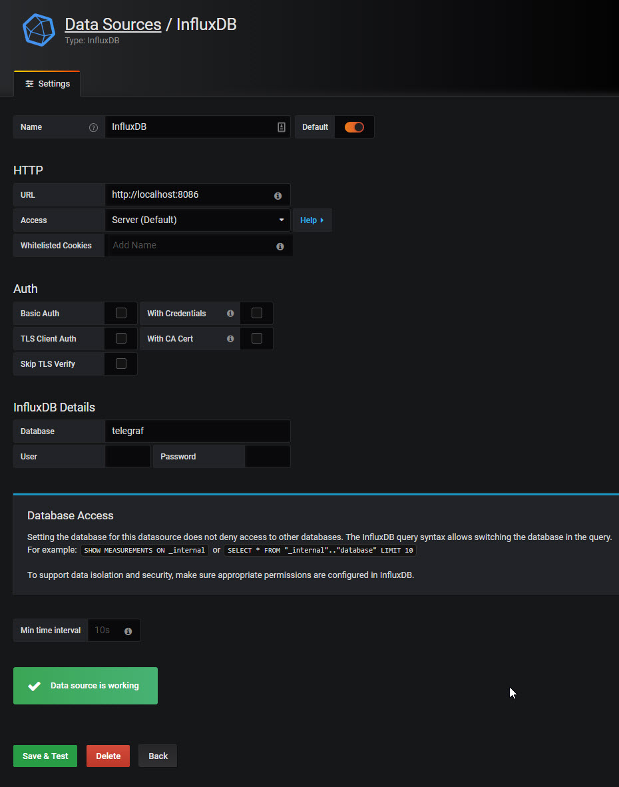
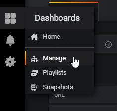
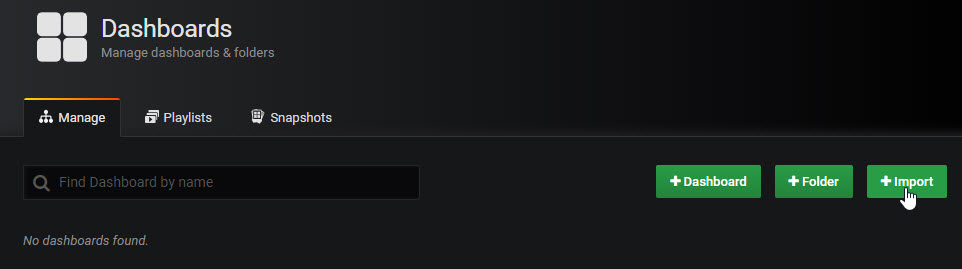
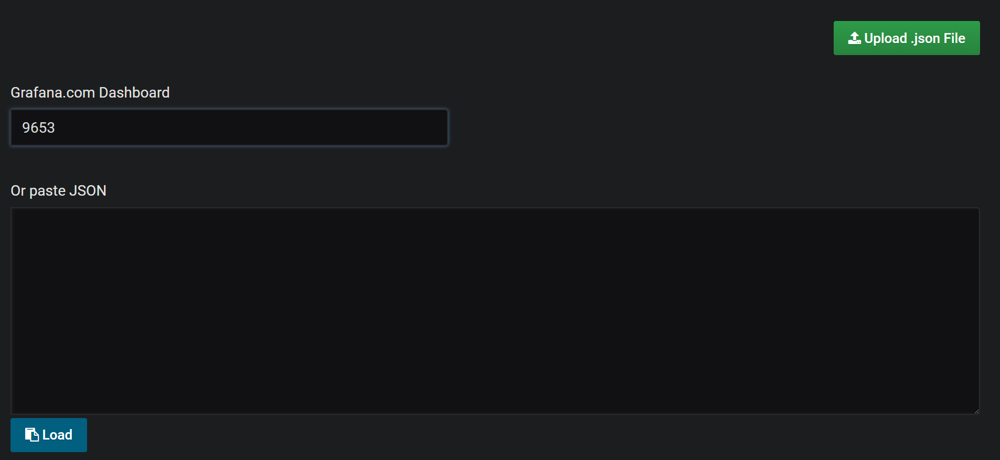
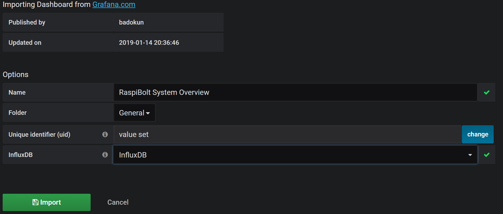
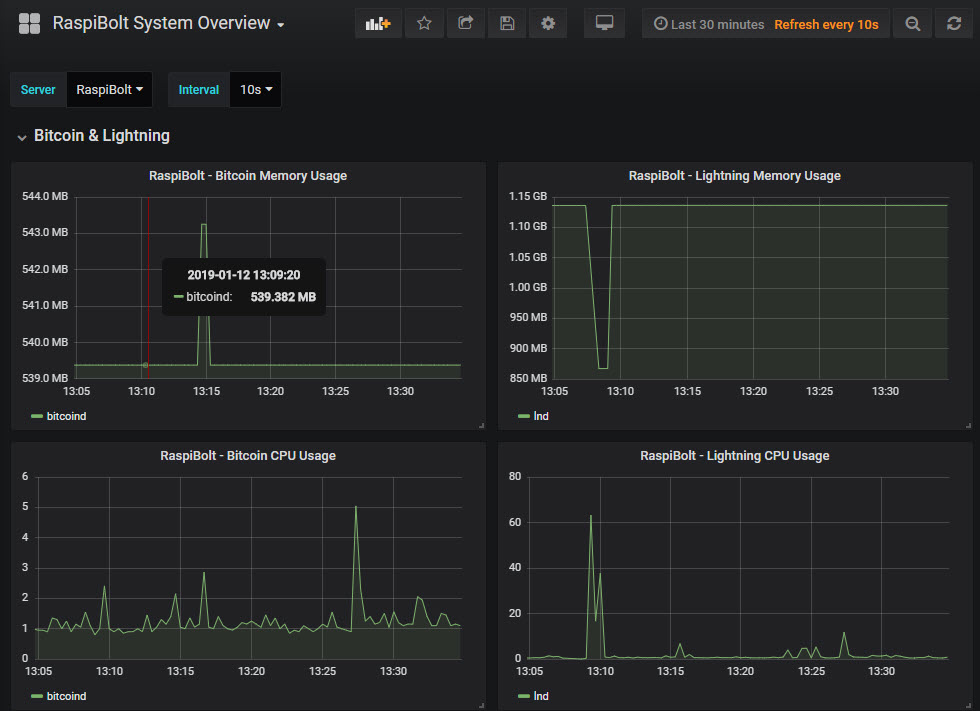

[ [Intro](intro.md) ] -- [ [**Performance Monitoring**](performance_monitoring.md) ] -- [ [Lightning Metrics](lightning_metrics.md) ] -- [ [Bonus](bonus.md) ] -- [ [Troubleshooting](troubleshooting.md) ]

------

# Performance Monitoring on a Raspberry

> Reference: Thanks to Pete Shima's [medium post](https://medium.com/@petey5000/monitoring-your-home-network-with-influxdb-on-raspberry-pi-with-docker-78a23559ffea) that helped greatly in setting this up.

## Overview

There are a four required pieces to get this working:

- Docker
- InfluxDB
- Telegraf
- Grafana

## Docker

[Docker](https://www.docker.com) is a computer program that performs operating-system-level virtualization, also known as "containerization". It was first released in 2013 and is developed by Docker, Inc. (source: [Wikipedia](https://en.wikipedia.org/wiki/Docker_(software)))

- Install Docker by executing the official install script.

  ```bash
  cd /home/admin/download
  curl -fsSL get.docker.com -o get-docker.sh
  sudo sh get-docker.sh
  ```

- Confirm that Docker is installed correctly.

  ```bash
  sudo docker --version
  Docker version 18.09.0, build 4d60db4
  ```

- If you're willing to take the security risk as [outlined here](https://docs.docker.com/engine/security/security/#docker-daemon-attack-surface) you can execute `docker` commands without the `sudo` prefix, alternatively include `sudo` before all docker commands that follow in this guide.

  ```bash
  sudo usermod -aG docker $USER
  ```

- Restart your Raspberry Pi for the changes to take effect and connect as user "admin".

  ```bash
  sudo shutdown -r now
  ```

- Now test Docker by running the "Hello world" image. As it is not yet locally available, Docker automatically retrieves it from the [Docker Hub](https://hub.docker.com/), starts it up and executes the container.

  ```bash
  docker run hello-world
  ```

## InfluxDB

[InfluxDB](https://www.influxdata.com/) is an open-source time series database (TSDB) developed by InfluxData. It is written in Go and optimized for fast, high-availability storage and retrieval of time series data in fields such as operations monitoring, application metrics, Internet of Things sensor data, and real-time analytics. (source: [Wikipedia](https://en.wikipedia.org/wiki/InfluxDB))

- Start the InfluxDB Docker image with auto-restart in the event of a system restart.

  ```bash
  docker run -d --name=influxdb --net=host --restart always --volume=/var/influxdb:/data hypriot/rpi-influxdb
  ```

- Add a retention policy so we don't have to worry about the InfluxDB growing in size beyond 6 months.

  ```bash
  docker ps
  CONTAINER ID        IMAGE                       COMMAND                  CREATED             STATUS              PORTS               NAMES
  b9f31d893601        hypriot/rpi-influxdb        "/usr/bin/entry.sh /…"   5 minutes ago       Up 5 minutes                              influxdb
  ```

- Use the InfluxDB `CONTAINER ID`, in the example above it's `b9f31d893601`, to open the Influx commandline interface. Enter the commands on lines with `>` directly into the CLI, without the `>`.

  ```bash
  $ docker exec -it b9f31d893601 /usr/bin/influx
  > CREATE DATABASE telegraf
  > USE telegraf
  Using database telegraf
  > CREATE RETENTION POLICY "six_months" ON "telegraf" DURATION 180d REPLICATION 1 DEFAULT
  > SHOW RETENTION POLICIES ON "telegraf"
  name       duration  shardGroupDuration replicaN default
  ----       --------  ------------------ -------- -------
  autogen    0s        168h0m0s           1        false
  six_months 4320h0m0s 168h0m0s           1        true
  
  > exit
  ```

## Telegraf

[Telegraf](https://docs.influxdata.com/telegraf) is a plugin-driven server agent for collecting & reporting metrics. It has output plugins to send metrics to a variety of other datastores, services, and message queues, including InfluxDB.

- Download and install the Telegraf package.

  ```bash
  cd /home/admin/download
  wget https://dl.influxdata.com/telegraf/releases/telegraf_1.7.0-1_armhf.deb
  sudo dpkg -i telegraf_1.7.0-1_armhf.deb
  rm telegraf_1.7.0-1_armhf.deb
  ```

- Telegraf is now installed service. Confirm and check if the program has been started successfully. Press `Ctrl-C` to exit.

  ```bash
  sudo systemctl status telegraf
  ```

- Configure Telegraf by downloading this custom [`telegraf.conf`](https://raw.githubusercontent.com/badokun/guides/master/raspibolt/resources/telegraf.conf) so that it publishes the data we can use later in the Grafana dashboard.

  ```bash
  cd /etc/telegraf/
  sudo mv telegraf.conf telegraf.conf.bak
  sudo wget https://raw.githubusercontent.com/badokun/guides/master/raspibolt/resources/telegraf.conf
  sudo systemctl restart telegraf
  ```

## Grafana

[Grafana](https://grafana.com/) is an open source platform for time series analytics and monitoring.

- Write down a strong password to access Grafana administration features

  ```bash
  [ A ] Grafana Admin password
  ```

- Create persistent storage for your Grafana configurationso, keeping it also during future upgrades.

  ```bash
  sudo docker volume create grafana-storage
  ```

- Run the Grafana's docker image, replacing the `admin` password setting `PASSWORD_[A]` with your password. This will be used when logging into Grafana's UI. Copy / paste all lines at once into your terminal.

  ```bash
  docker run \
    -d \
    -e "GF_SECURITY_ADMIN_PASSWORD=PASSWORD_[A]" \
    --name grafana \
    -v grafana-storage:/var/lib/grafana \
    --restart always \
    --net=host \
    grafana/grafana:5.4.3
  ```

- Confirm Grafana is running as a docker container.

  ```bash
  docker ps
  ```

  ```bash
  CONTAINER ID        IMAGE                    COMMAND                  CREATED              STATUS              PORTS               NAMES
  3194df6aff01        grafana/grafana:master   "/run.sh"                About a minute ago   Up About a minute                       grafana
  b9f31d893601        hypriot/rpi-influxdb     "/usr/bin/entry.sh /…"   30 minutes ago         Up 30 minutes                              influxdb
  ```

- To access the analytics webpage, we need to modify the firewall configuration to allow incomming connections to port 3000.
> Note the IP address range, yours may be 192.168.1.0/24 or different.

  ```bash
  sudo ufw allow from 192.168.1.0/24 to any port 3000 comment 'allow grafana from local LAN'
  ```

At this point the basic setup is complete and we can start to setup a Grafana Dashboard. Browse to `http://192.168.1.40:3000` in your browser (use the IP address of your RaspiBolt) and log in with `admin` and `PASSWORD_[A]`.



### Add a data source

Click on "Add data source", then "InfluxDB". Enter `telegraf` into the Database field



### Add a Dashboard

- Locate the shortcut to the left of the page and click on Manage

  

- Importing an existing Dashboard

  

- Enter the Grafana Dashboard Id of `9653` and click Load
  

- Select the InfluxDB from the drop down list and click on Import
  

## You should see the dashboard in all its glory



Once you've successfully completed this section, you can take things to the next level by following
[Lightning Metrics](lightning_metrics.md) instructions.

------

Donations

If you feel like this has beenn useful and wish to donate, feel free to send a satoshi or two to this address, obviously use Lightning for near free instant transfers:

* 👉 BTC: `bc1qx2hn38vc8f0fkn3hu8pmpuglg35ctqvx2rzzjs`
* 👉 Lightning: <https://tippin.me/@rubberroad>
